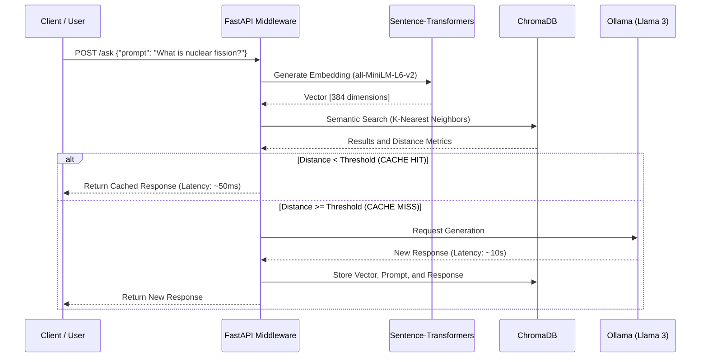
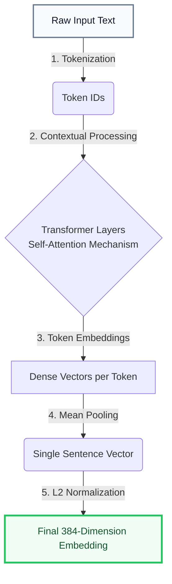
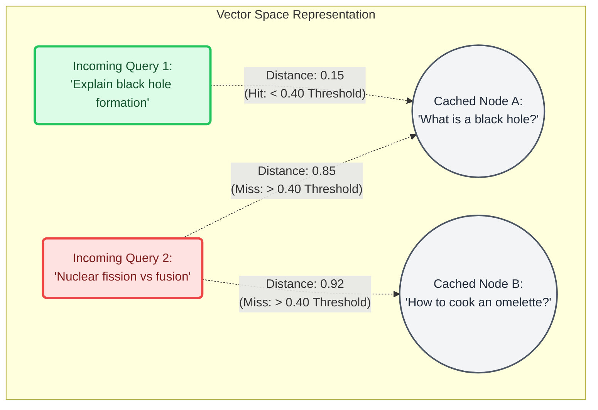

# LLM Semantic Cache API

A middleware service designed to optimize interactions with Large Language Models (LLMs) through Vector-based Semantic Caching. 

This project intercepts user requests, analyzes the underlying meaning of the prompt, and if it detects that a semantically equivalent query has been answered in the past, it instantly returns the cached response. This eliminates the need to re-process the prompt through the LLM, drastically reducing latency and computational costs (or token usage).

---

## 1. Project Overview

In traditional software architecture, caching relies on exact string matching (e.g., `Query A == Query B`). However, in Natural Language Processing (NLP), users can formulate the exact same question in hundreds of different ways. 

This project solves this limitation by implementing a semantic approach:
1. Converting incoming text into dense numerical vectors (Embeddings).
2. Storing these vectors in a specialized vector database alongside the LLM's generated response.
3. Calculating mathematical distances between vectors to determine if the user's underlying intent matches historical queries, regardless of the specific phrasing or syntax used.

## 2. Detailed Analysis and Architecture

### Architectural Flow

The system is fully containerized and orchestrates three primary services: the Web API, the Vector Search Engine, and the Local LLM. 



### Mathematical Foundations: Embeddings and Cosine Distance

The core mechanism of semantic caching relies on mapping abstract concepts (text) into a multidimensional geometric space.

This implementation utilizes the `all-MiniLM-L6-v2` model, which transforms any input text into a dense vector consisting of 384 dimensions. To evaluate the similarity between two prompts—a new query vector $A$ and a previously stored vector $B$—the system measures the angle between them using **Cosine Similarity**, rather than relying on Euclidean distance.

Cosine similarity is mathematically defined as the dot product of the vectors divided by the product of their magnitudes:

$$
\text{Similarity} = \cos(\theta) = \frac{\mathbf{A} \cdot \mathbf{B}}{\|\mathbf{A}\|\|\mathbf{B}\|} = \frac{\sum_{i=1}^{n}A_i B_i}{\sqrt{\sum_{i=1}^{n}A_i^2}\sqrt{\sum_{i=1}^{n}B_i^2}}
$$

Because the underlying vector database (ChromaDB) is configured to minimize a penalty metric rather than maximize a score, the system ultimately evaluates the **Cosine Distance**:

$$
\text{Distance} = 1 - \cos(\theta)
$$

- A distance of **0.0** indicates that the vectors share the exact same direction (identical semantic meaning).
- A distance of **1.0** indicates orthogonality (unrelated meanings).

In this specific API configuration, a threshold of **0.4** is established to validate a Cache Hit.

### Deep Dive: How Embeddings Work

Embeddings are the mathematical engine of the semantic cache. They bridge the gap between human language and machine-computable mathematics by translating text into high-dimensional vectors. Rather than looking at keywords, an embedding model captures the contextual meaning, intent, and relationships between words.

In this project, we utilize the `all-MiniLM-L6-v2` model from Sentence-Transformers. When a query is sent to this model, it goes through a strict transformation pipeline to become a 384-dimensional vector.

#### The Transformation Pipeline



#### Step-by-Step Breakdown

- **Tokenization:** The raw input string is broken down into smaller units called tokens (words or sub-words). These tokens are then mapped to integer IDs based on the model's pre-trained vocabulary.
- **Contextual Processing (Self-Attention):** The token IDs are passed through multiple Transformer neural network layers. Through the "self-attention" mechanism, the model analyzes the relationship between every word in the sentence. For example, it understands that "bank" in "river bank" is different from "bank" in "bank account" based on the surrounding words.
- **Mean Pooling:** After passing through the Transformer, each token has its own vector. To represent the entire sentence as a single concept, the model performs "Mean Pooling"—averaging the vectors of all individual tokens into one single, unified vector.
- **L2 Normalization:** Finally, the resulting sentence vector is normalized to have a length (magnitude) of 1. This step is crucial because it ensures that when ChromaDB calculates the Cosine Distance, it is purely comparing the angle (the semantic direction) of the vectors, completely ignoring their magnitude.

#### The Latent Space

The final output is an array of 384 floating-point numbers (e.g., `[0.034, -0.112, 0.891...]`). Each of these 384 dimensions represents an abstract, latent semantic feature learned by the model during its training on billions of sentences.

While these individual dimensions are not directly interpretable by humans (e.g., dimension 15 doesn't strictly mean "food"), combined, they place the query at a highly specific coordinate in a 384-dimensional space. Queries with similar meanings will naturally end up clustered in the same region of this space, which is what makes semantic caching possible.

### Visualizing Semantic Caching

The following diagram illustrates how incoming queries are plotted in the vector space and compared against previously cached queries. The system calculates the distance between the new vector and existing nodes to determine if a cache hit occurs.



## 3. Technology Stack and Dependencies

The project relies on a carefully selected stack of modern, open-source tools designed for high performance, local execution, and scalability. The architecture is divided into four main categories: Web Infrastructure, Machine Learning, Data Storage, and Containerization.

### Web Framework and API
*   **FastAPI:** A modern, fast (high-performance) web framework for building APIs with Python 3.8+ based on standard Python type hints. It was chosen for its asynchronous capabilities, speed (powered by Starlette), and automatic generation of interactive API documentation (Swagger UI).
*   **Uvicorn:** A lightning-fast ASGI web server implementation, used to serve the FastAPI application in the production container.
*   **Pydantic:** Used extensively by FastAPI for data validation and settings management. It ensures that incoming requests to the `/ask` endpoint strictly adhere to the defined data models.

### Machine Learning and NLP
*   **Sentence-Transformers:** A Python framework for state-of-the-art sentence and text embeddings. It provides the pipeline to easily load pre-trained models and compute dense vector representations.
*   **all-MiniLM-L6-v2:** The specific pre-trained embedding model utilized in this project. It was selected for its optimal balance between computational efficiency and semantic accuracy, generating 384-dimensional vectors extremely fast on standard CPU hardware.
*   **Ollama:** A lightweight, extensible framework designed to run Large Language Models locally. It manages the hardware resources and provides a clean API to interact with the models without requiring complex PyTorch/CUDA setups.
*   **Meta Llama 3 (8B):** The underlying Large Language Model used as the fallback generator. When a cache miss occurs, Ollama provisions this model to generate the actual response.

### Vector Storage
*   **ChromaDB:** An AI-native, open-source vector database. It is used in its persistent client mode to store the generated embeddings, the original user prompts, and the LLM-generated responses. ChromaDB was chosen because it allows for local, in-memory execution with disk persistence, eliminating the need for a cloud-based vector database and ensuring total data privacy.

### Infrastructure and Orchestration
*   **Docker:** Used to containerize the Python API environment, ensuring that all dependencies (like Uvicorn, FastAPI, and Sentence-Transformers) are locked in and execute consistently across any operating system.
*   **Docker Compose:** Orchestrates the multi-container architecture. It manages the networking layer between the FastAPI container and the Ollama container, and handles the persistent volume mounts required for ChromaDB and Ollama's model storage.

## 4. Deployment and Testing Guide

The project is designed to be easily reproducible using Docker. Follow these steps to deploy the infrastructure and test the semantic caching mechanism.

### Prerequisites
*   **Docker and Docker Compose** installed on your system.
*   **Hardware Requirements:** A minimum of 8GB of RAM is recommended to run the Llama 3 (8B) model locally without severe performance degradation.

### Step 1: Build and Deploy

Clone the repository and navigate to the project root directory. Execute the following command to build the API image and start the containers in detached mode:

```bash
git clone <YOUR_REPOSITORY_URL>
cd <REPOSITORY_NAME>
docker-compose up -d --build
```

### Step 2: Provision the Local LLM

The Ollama container boots up without any models pre-installed. You must pull the Llama 3 model into the container's volume. Run the following command and wait for the download to complete (approximately 4.7 GB):

```bash
docker exec -it ollama_llm ollama pull llama3
```

### Step 3: Interactive Testing

Once the model is downloaded, the API will be fully operational. You can test it using the automatic Swagger UI documentation or via terminal using cURL.

#### Method A: Using the Browser (Swagger UI)
Navigate to `http://127.0.0.1:8000/docs` and locate the `POST /ask` endpoint.

#### Method B: Using cURL
You can execute the following scenarios directly from your terminal.

**Scenario 1: Triggering a Cache Miss**
Send a completely new query to the system. The API will generate an embedding, find no matches in ChromaDB, and forward the request to the local LLM.

```bash
curl -X 'POST' \
  'http://127.0.0.1:8000/ask' \
  -H 'accept: application/json' \
  -H 'Content-Type: application/json' \
  -d '{
  "prompt": "What are the differences between nuclear fission and fusion?"
}'
```

**Expected Result:** The request will take several seconds to process. The response JSON will indicate `"status": "cache_miss (new generation)"` and will return the newly generated text from Llama 3. The system silently stores this vector and response in the database.

**Scenario 2: Triggering a Cache Hit**
Send a new request with different wording but the exact same semantic intent.

```bash
curl -X 'POST' \
  'http://127.0.0.1:8000/ask' \
  -H 'accept: application/json' \
  -H 'Content-Type: application/json' \
  -d '{
  "prompt": "Explain how atomic fission differs from nuclear fusion."
}'
```

**Expected Result:** The request will return almost instantly (milliseconds). The embedding model recognizes the semantic proximity to the previous query. The response JSON will indicate `"status": "cache_hit"`, display the calculated distance (e.g., 0.12), and return the exact text generated in Scenario 1 without invoking the LLM.

### State Management Note

The vector database (`chroma_db`) and the downloaded LLM weights (`ollama_data`) are stored in local directories mapped as Docker volumes to ensure data persistence across container restarts. These directories are excluded from version control via the `.gitignore` file. To completely reset the semantic cache and start from a blank slate, stop the containers, delete the local `chroma_db` directory, and restart the services.