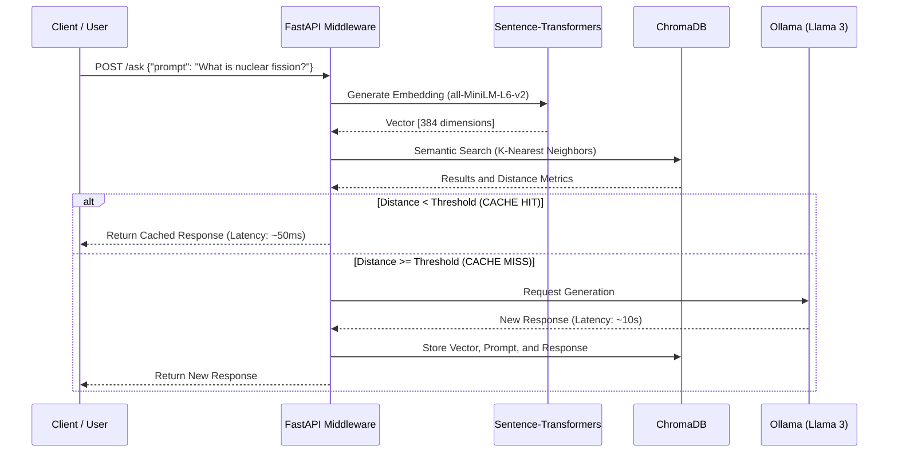

# LLM Semantic Cache API

A middleware service designed to optimize interactions with Large Language Models (LLMs) through Vector-based Semantic Caching. 

This project intercepts user requests, analyzes the underlying meaning of the prompt, and if it detects that a semantically equivalent query has been answered in the past, it instantly returns the cached response. This eliminates the need to re-process the prompt through the LLM, drastically reducing latency and computational costs (or token usage).

---

## 1. Project Overview

In traditional software architecture, caching relies on exact string matching (e.g., `Query A == Query B`). However, in Natural Language Processing (NLP), users can formulate the exact same question in hundreds of different ways. 

This project solves this limitation by implementing a semantic approach:
1. Converting incoming text into dense numerical vectors (Embeddings).
2. Storing these vectors in a specialized vector database alongside the LLM's generated response.
3. Calculating mathematical distances between vectors to determine if the user's underlying intent matches historical queries, regardless of the specific phrasing or syntax used.

## 2. Detailed Analysis and Architecture

### Architectural Flow

The system is fully containerized and orchestrates three primary services: the Web API, the Vector Search Engine, and the Local LLM. 

### Mathematical Foundations: Embeddings and Cosine Distance

The core mechanism of semantic caching relies on mapping abstract concepts (text) into a multidimensional geometric space.

This implementation utilizes the `all-MiniLM-L6-v2` model, which transforms any input text into a dense vector consisting of 384 dimensions. To evaluate the similarity between two prompts—a new query vector $A$ and a previously stored vector $B$—the system measures the angle between them using **Cosine Similarity**, rather than relying on Euclidean distance.

Cosine similarity is mathematically defined as the dot product of the vectors divided by the product of their magnitudes:

$$
\text{Similarity} = \cos(\theta) = \frac{\mathbf{A} \cdot \mathbf{B}}{\|\mathbf{A}\|\|\mathbf{B}\|} = \frac{\sum_{i=1}^{n}A_i B_i}{\sqrt{\sum_{i=1}^{n}A_i^2}\sqrt{\sum_{i=1}^{n}B_i^2}}
$$

Because the underlying vector database (ChromaDB) is configured to minimize a penalty metric rather than maximize a score, the system ultimately evaluates the **Cosine Distance**:

$$
\text{Distance} = 1 - \cos(\theta)
$$

- A distance of **0.0** indicates that the vectors share the exact same direction (identical semantic meaning).
- A distance of **1.0** indicates orthogonality (unrelated meanings).

In this specific API configuration, a threshold of **0.4** is established to validate a Cache Hit.